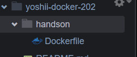

# はじめてのDocker for インフラエンジニア

Docker に触れたことがないインフラエンジニア向けに勉強会を開催しました。  
ローカルで Docker を動かし、インフラっぽい動作確認を行い、Amazon ECS で動かすところまでを紹介します。  


## Cloud9 ロールの作成

EC2 インスタンスプロファイルです。Cloud9 のインスタンスで使用します。   
ロール名は EC2Cloud9Role としました。(任意に変更してOK)  

マネジメントコンソール <a href="https://console.aws.amazon.com/iam/home?region=ap-northeast-1#/roles" target="_blank">IAM ロール</a> を開きます。  

**ロールの作成** をクリックします。  

**ユースケースの選択** → **一般的なユースケース** → **EC2** を選択して、**次のステップ** へ進みます。  

Attach アクセス権限ポリシー画面で割り当てるポリシーは以下です。  

 * AmazonEC2ContainerRegistryFullAccess
 * ElasticLoadBalancingFullAccess
 * AmazonECS_FullAccess
 * IAMFullAccess

このあとはロール名を入力してロールを作成します。  

## Cloud9 インスタンスの作成

<a href="https://ap-northeast-1.console.aws.amazon.com/cloud9/home" target="_blank">Cloud9 画面</a> を開きます。  

**Create environment** をクリックします。  

任意の名称を入力して、次へ進みます。  

Environment Type は **Create a new EC2 instance for environment (direct access)** を選択します。  

**Network Setting** を展開して、任意の VPC とパブリックサブネットを選択します。  

## インスタンスプロファイルの作成
<a href="https://ap-northeast-1.console.aws.amazon.com/ec2/v2/home?region=ap-northeast-1#Instances:" target="_blank">EC2 インスタンス画面</a> を開くと **aws-cloud9-xxxx** というインスタンスが起動しているはずです。  
そのインスタンスに前の手順で作成したインスタンスプロファイルを関連付けます。    

## AMTC 無効
AWS Managed Temporary Credentials (AMTC) を無効にしておきます。  
無効にする方法は以下に詳しいです。  

[Cloud9からIAM Roleの権限でAWS CLIを実行する](https://hatenablog-parts.com/embed?url=https://dev.classmethod.jp/articles/execute-aws-cli-with-iam-role-on-cloud9/)

## Dockerのインストール

**これ以降は Cloud9 で手順を実行してください。**  

まずは docker がインストールされていることの確認をします。

```Shell
$ docker -v
```

万が一インストールされていなければインストールします。

```Shell
sudo yum install -y docker
```

## ハンズオンディレクトリを作ってみよう

ハンズオン用のディレクトリを作っておきます。  

```Shell
mkdir handson
cd handson
```

## Nginxを動かしてみよう

```Shell
docker run --name web -d -p 80:80 nginx
```

ローカルに Web サーバーが起動したはずです。  
確認してみます。  

```Shell
curl http://localhost/
```

「Welcome to nginx!」というデフォルトのサンプルページが表示されました。  

```
<!DOCTYPE html>
<html>
<head>
<title>Welcome to nginx!</title>
～～省略～～
```

```Shell
docker ps -a
```

```
CONTAINER ID   IMAGE     COMMAND                  CREATED         STATUS         PORTS                               NAMES
4477a272ce0c   nginx     "/docker-entrypoint.…"   3 minutes ago   Up 3 seconds   0.0.0.0:80->80/tcp, :::80->80/tcp   web
```


```Shell
docker stop web
```

```Shell
curl http://localhost/
```


```Shell
docker ps -a
```

```
CONTAINER ID   IMAGE     COMMAND                  CREATED         STATUS                      PORTS     NAMES
4477a272ce0c   nginx     "/docker-entrypoint.…"   5 minutes ago   Exited (0) 52 seconds ago             web
```


```Shell
docker rm web
```

何も表示されなくなりました。（つまり削除された）  

```
CONTAINER ID   IMAGE     COMMAND   CREATED   STATUS    PORTS     NAMES
```

## Dockerfileを作ってみよう

```Shell
touch Dockerfile
```




```Shell
docker build -t testweb .
```


```Shell
docker images
```

```
REPOSITORY      TAG          IMAGE ID       CREATED        SIZE
testweb         latest       87a94228f133   3 weeks ago    133MB
```


```Shell

```


```Shell

```


```Shell

```
