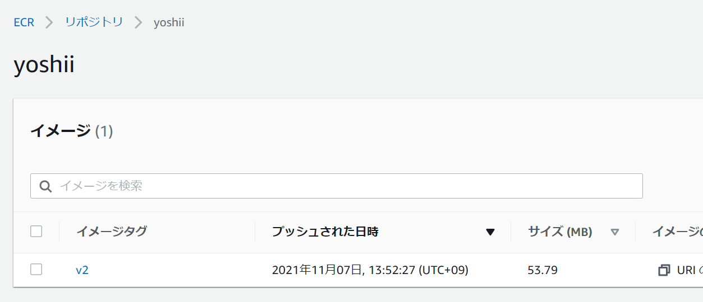

# はじめてのDocker for インフラエンジニア

Docker に触れたことがないインフラエンジニア向けに勉強会を開催しました。  
ローカルで Docker を動かし、インフラっぽい動作確認を行い、Amazon ECS で動かすところまでを紹介します。  


## Cloud9 ロールの作成

EC2 インスタンスプロファイルです。Cloud9 のインスタンスで使用します。   
ロール名は EC2Cloud9Role としました。(任意に変更してOK)  

マネジメントコンソール <a href="https://console.aws.amazon.com/iam/home?region=us-west-2#/roles" target="_blank">IAM ロール</a> を開きます。  

**ロールの作成** をクリックします。  

**ユースケースの選択** → **一般的なユースケース** → **EC2** を選択して、**次のステップ** へ進みます。  

Attach アクセス権限ポリシー画面で割り当てるポリシーは以下です。  
※ 勉強会用です。本番アカウントでは適切に権限を絞ってください。  

 * AmazonEC2ContainerRegistryFullAccess
 * ElasticLoadBalancingFullAccess
 * AmazonECS_FullAccess
 * IAMFullAccess

このあとはロール名を入力してロールを作成します。  

## Cloud9 インスタンスの作成

勉強会ということで時間単価が安いオレゴンリージョン（us-west-2）を使います。  
マネジメントコンソールでオレゴンリージョンに切り替えてください。  

<a href="https://us-west-2.console.aws.amazon.com/cloud9/home" target="_blank">Cloud9 画面</a> を開きます。  

**Create environment** をクリックします。  

任意の名称を入力して、次へ進みます。  

Environment Type は **Create a new EC2 instance for environment (direct access)** を選択します。  

**Network Setting** を展開して、任意の VPC とパブリックサブネットを選択します。  

## インスタンスプロファイルの作成
<a href="https://us-west-2.console.aws.amazon.com/ec2/v2/home?region=us-west-2#Instances:" target="_blank">EC2 インスタンス画面</a> を開くと **aws-cloud9-xxxx** というインスタンスが起動しているはずです。  
そのインスタンスに前の手順で作成したインスタンスプロファイルを関連付けます。    

## AMTC 無効
AWS Managed Temporary Credentials (AMTC) を無効にしておきます。  
無効にする方法は以下に詳しいです。  

[Cloud9からIAM Roleの権限でAWS CLIを実行する](https://dev.classmethod.jp/articles/execute-aws-cli-with-iam-role-on-cloud9/)

## Dockerのインストール

**これ以降は Cloud9 で手順を実行してください。**  

まずは docker がインストールされていることの確認をします。

```Shell
docker -v
```

万が一インストールされていなければインストールします。

```Shell
sudo yum install -y docker
```

## ハンズオンディレクトリを作ってみよう

ハンズオン用のディレクトリを作っておきます。  

```Shell
mkdir handson
cd handson
```

## Nginxを動かしてみよう

docker run コマンドを打ってみましょう。  

```Shell
docker run --name web -d -p 80:80 nginx
```

コマンド引数の意味は以下の通りです。  

| 引数   | 意味                                                                                   |
| ------ | -------------------------------------------------------------------------------------- |
| --name | コンテナに名前を割り当て。                                                             |
| -d     | バックグランドで実行。                                                                 |
| -p     | ポートのバインドと公開です。ローカルホストのポート:コンテナのポート の順で指定します。 |
| nginx  | イメージを指定。今回は Docker Hub 上の nginx イメージを取得しています。                |

ローカルに Web サーバーが起動したはずです。  
curl コマンドで確認してみます。  

```Shell
curl http://localhost/
```

「Welcome to nginx!」というデフォルトのサンプルページが表示されました。  

```
<!DOCTYPE html>
<html>
<head>
<title>Welcome to nginx!</title>
～～省略～～
```

### 実行中のコンテナを表示

docker ps コマンドで実行中のコンテナを表示します。  
`-a` を付けると停止しているコンテナも含めて表示になります。  

```Shell
docker ps -a
```

コンテナが表示されました。  
`docker run --name` で指定した名前が NAMES 列で確認できます。  
起動しているコンテナなので STATUS は UP です。  
PORTS 列ではローカルホストのポートとコンテナポートのバインドが確認できます。  

```
CONTAINER ID   IMAGE     COMMAND                  CREATED         STATUS         PORTS                               NAMES
4477a272ce0c   nginx     "/docker-entrypoint.…"   3 minutes ago   Up 3 seconds   0.0.0.0:80->80/tcp, :::80->80/tcp   web
```

### 実行中のコンテナを停止する

コンテナを停止するコマンドです。  
stop は SIGTERM を送信し、一定期間後に SIGKILL を送信します。  

```Shell
docker stop web
```

docker ps コマンドでコンテナを表示します。  

```Shell
docker ps -a
```

STATUS が「Exited」に変わっています。  

```
CONTAINER ID   IMAGE     COMMAND                  CREATED         STATUS                      PORTS     NAMES
4477a272ce0c   nginx     "/docker-entrypoint.…"   5 minutes ago   Exited (0) 52 seconds ago             web
```

### コンテナを削除する

起動や停止、削除が容易なことがコンテナのメリットの一つです。  
コンテナは気軽に削除しましょう。  
仮想サーバーと違いコンテナを停止したまま置いておくことにたいした意味は無いはずです。  

```Shell
docker rm web
```

何も表示されなくなりました。（つまり削除された）  

```
CONTAINER ID   IMAGE     COMMAND   CREATED   STATUS    PORTS     NAMES
```

docker rm を毎回打つのが面倒な場合は  
docker run 時に `--rm` を付けることでコンテナ終了時に自動削除することも可能です。  

## Dockerfileを作ってみよう

これまでの手順では出来合いの nginx を使ってコンテナを起動していました。  
実際にサービスを提供するとなると、出来合いのコンテナイメージだけでは不十分です。  
様々なカスタマイズを行うのですが、docker run の引数指定だけでカスタマイズを行うのは現実的ではありません。  

Dockerfile という便利なものが用意されていますので、これをフル活用していきます。  

"FROM nginx" と一行だけ書かれた Dockerfile を作ります。  
FROM 行はベースイメージをどこから持ってくるかの指定です。  
今回は Docker Hub 上の公式 nginx イメージを使う指定です。  

```Shell
echo "FROM nginx" > Dockerfile
```

Cloud9 の左側メニューのエクスプローラーで作ったばかりの Dockerfile を開きます。  


Dockerfile には以下の1行が書かれていると思います。  

```
FROM nginx
```

## Docker ビルド

Dockerfile を作っただけでは何も変化はありません。  
ビルドを行い独自のイメージを作成します。  

以下のコマンドでビルドします。  

```Shell
docker build -t testweb .
```

| 引数 | 意味                                                                                                 |
| ---- | ---------------------------------------------------------------------------------------------------- |
| -t   | イメージ名:タグ 形式でイメージを作成。今回のようにタグを省略すると latest というタグが付与されます。 |
| .    | Dockerfile のパス。. （ドット）はカレントディレクトリを示します。                                    |


作成したイメージを表示するコマンドです。  

```Shell
docker images
```

`-t` で指定した「testweb」でイメージが登録されています。  

```
REPOSITORY      TAG          IMAGE ID       CREATED        SIZE
testweb         latest       87a94228f133   3 weeks ago    133MB
```

それでは、ビルドしたイメージでコンテナを起動します。  
緊張しますね。  

```Shell
docker run --name testweb -d -p 80:80 testweb:latest
```

curl で確認してみましょう。  

```Shell
curl http://localhost/
```

自分でビルドしたイメージを使えるようになると初心者を脱したような気持ちになれます。  
Docker が楽しくなってくると思います。  

## カスタマイズしてみよう

Dockerfile をビルドしました。  
が、まだ「素の nginx」を起動しただけです。  
続いてカスタマイズをしていきます。  

Dockerfile に COPY 行を追記します。  
ローカルにある index.html をコンテナの /usr/share/nbinx/html/ にコピーするという意味です。  

```
FROM nginx

COPY index.html /usr/share/nginx/html/
```

index.html をローカルに作ります。  

```Shell
echo "hello hello" > index.html
```

Dockerfile を更新した後は、ビルドを行います。  
前の手順で起動したコンテナは不要になるので削除しています。  
ビルド～削除～起動～ curl まで一気に実行してしまいましょう。  

```Shell
docker build -t testweb .
docker rm -f testweb
docker run --name testweb -d -p 80:80 testweb:latest

curl http://localhost/
```

作成した index.html が期待通りに表示されました。  

```
hello hello
```

## 演習

index.html に自分の名前を書いて curl で表示してみましょう。  


## コンテナのなかに入ってみよう

今回の記事はインフラエンジニア向けに書いています。  
インフラエンジニアたる者、やはり動いているもののなかには入っていきたいですよね！  

動いているコンテナを覗いてみましょう。  
実際にもローカルでビルドして動作確認する、デバッグするということは珍しくありません。  
以下のコマンドを覚えておきましょう。  

`exec -it` に続けてコンテナ名、呼び出すプログラムを指定します。  
`/bin/bash` を指定することでインタラクティブに bash を操作します。  
イメージによってシェルは異なります。今回使っている nginx イメージは bash なだけです。  

```Shell
docker exec -it testweb /bin/bash
```

ls コマンドや cd コマンドを打ってみてください。コンテナのなかを旅できます。  
コピーした index.html を cat することもできます。  

```Shell
cat /usr/share/nginx/html/index.html
```

exit で抜けます。  

```Shell
exit
```

## ログを確認しよう

コンテナでは何らかのプロセスが起動しています。（今回は nginx）  
トラブルシュートのためにログを読みたいです。  
コンテナは基本的に標準出力や標準エラーをログ出力先に指定します。  

コンテナのログを読むコマンドが docker logs です。  

```Shell
docker logs testweb
```

nginx ではアクセスログを標準出力に出しています。  
curl でアクセスするたびにログが増えていくことが確認できるはずです。  

## Dockerイメージにタグを付けよう

Docker イメージはタグを付けることが可能です。  
タグはビルドするたびにユニークな文字列を付与していきます。  
バージョンを数字でインクリメントしていく、日付時刻を付与する、Git と連携しているならコミット ID を付与するなど様々なタグ付け方法が世の中に溢れています。  

今までの手順で作成したイメージを見てみます。  

```Shell
docker images testweb
```


```
REPOSITORY   TAG       IMAGE ID       CREATED          SIZE
testweb      latest    fb387cb2215e   24 minutes ago   133MB
```

タグは「latest」になっています。これがデフォルトです。  
ただ、latest は極力使わないようにしましよう。  
latest タグでコンテナを起動させると、どの状態でビルドされたイメージなのか分からず、トラブルシュート時に困ります。  
また、クラウド上でコンテナを実行させる際にも動作確認前のイメージが予期せずデプロイされてしまう事故にもなりかねません。  

タグを付けるコマンドは docker tag です。  
タグ付けする元イメージ、新しいタグ の順で引数を指定します。  

```Shell
docker tag testweb:latest testweb:v1
```

上のコマンドで v1 のタグを付けました。  
確認してみます。  

```Shell
docker images testweb
```

下のような結果になるはずです。  
確かに v1 のタグが付いています。  

```
REPOSITORY   TAG       IMAGE ID       CREATED          SIZE
testweb      latest    fb387cb2215e   26 minutes ago   133MB
testweb      v1        fb387cb2215e   26 minutes ago   133MB
```

ビルド時にタグ付けるすることも可能です。  
基本的にはビルド時にタグ付けするようにしましょう。  

```Shell
docker build -t testweb:v2 .
```

コンテナを起動する際は docker run でタグ付けイメージを指定します。  

```Shell
docker run --name testweb -d -p 80:80 testweb:v2
```

## Dockerイメージを削除してみよう

使わなくなった古いイメージを削除します。  
イメージは `/var/lib/docker` に溜まっていきます。使わないイメージは削除しましょう。    

```Shell
docker rmi testweb:v1
```

ローカルで悪戦苦闘していると REPOSITORY が none のイメージが作成されることがあります。  
サクっと消してしまいましょう。  

```Shell
docker image prune
```

## 演習

今日の日付をタグにしたイメージをビルドしてみましょう。  
そのイメージで docker run してログを確認してみましょう。  
コンテナを停止してそのイメージは削除しましょう。  

## ECRへプッシュしてみよう

ローカルでビルドが完了したイメージはリポジトリにプッシュします。  
今回は AWS マネージドな ECR へプッシュします。  

勉強会ということで時間単価が安いオレゴンリージョン（us-west-2）を使います。  
4行目の MYNAME 変数は自分の名前を代入します。  

```Shell
sudo yum install jq -y

export AWS_DEFAULT_REGION=us-west-2
export MYNAME=your_name

aws ecr create-repository --repository-name ${MYNAME}
```

以下のコマンド実行し Login Succeeded と表示されることを確認します。  

```Shell
eval $(aws ecr get-login --no-include-email)
```

ローカルのイメージ名を ECR リポジトリ名に変更します。  
ECR へプッシュするために必要な操作です。  
リポジトリ URL は長いので describe-repositories で取得してきます。  

```Shell
REPOURL=$(aws ecr describe-repositories --repository-name ${MYNAME} | jq -r .repositories[].repositoryUri)

docker tag testweb:v2 ${REPOURL}:v2
```

イメージ名を確認してみます。  

```Shell
docker images
```

登録されています。問題ありません。  
※ ECR のイメージだけに絞って例示しています。  

```
REPOSITORY                                            TAG       IMAGE ID       CREATED       SIZE
123456789012.dkr.ecr.us-west-2.amazonaws.com/yoshii   v2        fb387cb2215e   3 hours ago   133MB
```

docker push コマンドで ECR へ送り込みます。  

```Shell
docker push ${REPOURL}:v2
```

マネジメントコンソールで [ECR](https://us-west-2.console.aws.amazon.com/ecr/repositories?region=us-west-2) を開き、自分の名前のリポジトリ内に「v2」とタグ付けされたイメージが存在することを確認します。  

  

## ECSで動かしてみましょう

ECS クラスター＆サービスを作成してコンテナを起動します。  
今回は ECS CLI を使ってみることにします。  

[AWS ECS CLI のインストール](https://docs.aws.amazon.com/ja_jp/AmazonECS/latest/developerguide/ECS_CLI_installation.html)  

Cloud9 インスタンスに ECS CLI をインストールします。  

```Shell
sudo curl -Lo /usr/local/bin/ecs-cli https://amazon-ecs-cli.s3.amazonaws.com/ecs-cli-linux-amd64-latest
sudo chmod +x /usr/local/bin/ecs-cli
ecs-cli --version
```

## 実行ロールの作成

ECS 実行ロールを作成します。  
ロールには「AmazonECSTaskExecutionRolePolicy」という管理ポリシーを付与します。  

```Shell
cat <<EOF > task-execution-assume-role.json
{
  "Version": "2012-10-17",
  "Statement": [
    {
      "Sid": "",
      "Effect": "Allow",
      "Principal": {
        "Service": "ecs-tasks.amazonaws.com"
      },
      "Action": "sts:AssumeRole"
    }
  ]
}
EOF

aws iam --region us-west-2 create-role \
  --role-name ecsTaskExecutionRole_${MYNAME} \
  --assume-role-policy-document file://task-execution-assume-role.json

aws iam --region us-west-2 attach-role-policy \
  --role-name ecsTaskExecutionRole_${MYNAME} \
  --policy-arn arn:aws:iam::aws:policy/service-role/AmazonECSTaskExecutionRolePolicy
```

マネジメントコンソールで VPC 画面を開きます。  
Cloud9 と同じ VPC とサブネットを特定します。  
VPC-ID とサブネット ID を調べて環境変数に代入します。  
※ サブネットはパブリックサブネットを2つ指定してください。1つしかサブネットが無い場合は作ってください。  

```Shell
VPCID=vpc-xxxxxxxxxxxxxxxxx
SUBNET1=subnet-xxxxxxxxxxxxxxxxx 
SUBNET2=subnet-yyyyyyyyyyyyyyyyy
```

セキュリティグループを作ります。  
80番ポートを開放しています。  

```Shell
SGID=$(aws ec2 create-security-group --group-name ecs_${MYNAME} --description "My security group" --vpc-id ${VPCID} | jq -r .GroupId)

aws ec2 authorize-security-group-ingress \
    --group-id ${SGID} \
    --protocol tcp \
    --port 80 \
    --cidr 0.0.0.0/0
```

ECS クラスターを作成します。  

```Shell
ecs-cli configure --cluster ${MYNAME} --default-launch-type FARGATE --config-name ${MYNAME} --region us-west-2

ecs-cli up --cluster-config ${MYNAME} --ecs-profile ${MYNAME}-profile \
  --subnets ${SUBNET1},${SUBNET2} \
  --vpc ${VPCID}
```

コマンド出力の最終行に「secceeded」が表示されることを確認します。  
マネジメントコンソールで ECS クラスターを確認してみてください。  

```
Cluster creation succeeded.
```

ECS サービスを作成します。  
これが成功するとコンテナが AWS 上で起動します。  

```Shell
cat <<EOF > docker-compose.yml
version: '3'
services:
  web:
    image: ${REPOURL}:v2
    ports:
      - "80:80"
    logging:
      driver: awslogs
      options: 
        awslogs-group: ${MYNAME}
        awslogs-region: us-west-2
        awslogs-stream-prefix: web
EOF

cat <<EOF > ecs-params.yml
version: 1
task_definition:
  task_execution_role: ecsTaskExecutionRole_${MYNAME}
  ecs_network_mode: awsvpc
  task_size:
    mem_limit: 0.5GB
    cpu_limit: 256
run_params:
  network_configuration:
    awsvpc_configuration:
      subnets:
        - "${SUBNET1}"
        - "${SUBNET2}"
      security_groups:
        - "${SGID}"
      assign_public_ip: ENABLED
EOF
```

```Shell
ecs-cli compose --project-name ${MYNAME} service up \
  --create-log-groups \
  --cluster-config ${MYNAME} \
  --ecs-profile ${MYNAME}-profile
```

ECS サービスの状態を確認します。  

```Shell
ecs-cli compose --project-name ${MYNAME} service ps \
  --cluster-config ${MYNAME} \
  --ecs-profile ${MYNAME}-profile
```

docker ps と似たような出力が表示されます。  
Ports 列にパブリック IP アドレスが表示されています。これをコピーしブラウザで開きます。  
※ 商用環境では前段に ELB を配置しますが今回は勉強会なのでコンテナ直接アクセスです。  

```
Name                                         State    Ports                     TaskDefinition  Health
yoshii/2fc68bd0d6d2458e9c2709dde99d0fbf/web  RUNNING  nn.nn.nn.nn:80->80/tcp  yoshii:1        UNKNOWN
```

## 演習

マネジメントコンソールで ECS サービスやタスクがどのように表示されるか確認します。  
CloudWatch Logs にコンテナのログが保管されています。ログ内容を表示します。  

## クリーンアップ

無駄な課金を防ぐためにリソースはクリーンアップします。  

```Shell
ecs-cli compose --project-name ${MYNAME} service down \
  --cluster-config ${MYNAME} \
  --ecs-profile ${MYNAME}-profile

ecs-cli down --force --cluster-config ${MYNAME} --ecs-profile ${MYNAME}-profile
```

その他のリソースは手動で削除します。  

- セキュリティグループ
- CloudWatch Logs
- ECR
- Cloud9
